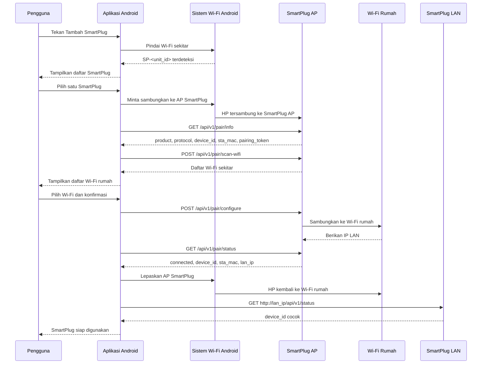
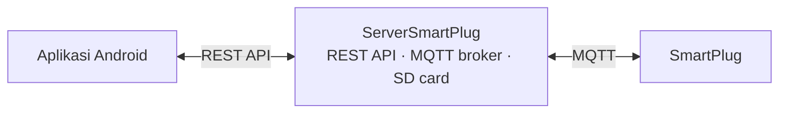
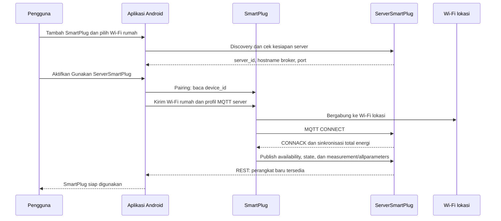

# SmartPlug integration design

> **Status dokumen — 26 September 2026.** Dokumen ini menjelaskan perilaku
> yang sudah ada pada source build `esp07_product`, `server_esp32`, dan Android
> debug saat ini, kecuali bagian yang secara eksplisit diberi label *batasan*
> atau *belum terverifikasi fisik*. Build berhasil bukan bukti perangkat telah
> di-upload, terhubung ke Wi-Fi, menggerakkan relay, atau membaca meter secara
> benar di produk fisik.

## Ringkasan kondisi terkini

| Komponen | Kondisi source saat ini |
|---|---|
| Android | Onboarding AP, monitoring, grafik, riwayat, reset energi tiga konfirmasi, timer, Schedule, pemilih bahasa Indonesia/English, serta ringkasan Home telah diimplementasikan. Sejumlah teks lama pada dialog/onboarding masih perlu penyelarasan penuh. |
| SmartPlug `esp07_product` | Pairing API, REST langsung, LittleFS counter energi, NTP, timer, Schedule harian, dan label Event telah diimplementasikan. |
| ServerSmartPlug `server_esp32` | MQTT broker, REST aplikasi, SD-card riwayat/energi, timer, dan Schedule harian tersimpan telah diimplementasikan. |
| Validasi fisik | Belum dibuktikan oleh build; membutuhkan upload dan uji perangkat terisolasi. |

Schedule dan timer berjalan pada firmware/server, bukan pada proses aplikasi.
Karena itu keduanya tetap bekerja ketika aplikasi ditutup. Schedule merupakan
aturan harian pada jam `HH:mm` (24 jam), dengan maksimal delapan entry per
SmartPlug. Setiap entry berisi aksi `ON`/`OFF` dan label Event opsional.

## Outline

1. [Mode tanpa server (REST langsung)](#mode-tanpa-server-rest-langsung)
   - [Tujuan](#tujuan)
   - [Varian fisik](#varian-fisik)
   - [Hasil onboarding](#hasil-onboarding)
   - [Pengalaman pengguna](#pengalaman-pengguna)
   - [Standar nama discovery](#standar-nama-discovery)
   - [Alur sistem](#alur-sistem)
   - [Keadaan perangkat](#keadaan-perangkat)
   - [Pairing API](#pairing-api)
   - [Password Wi-Fi rumah](#password-wi-fi-rumah)
   - [Perpindahan HP dari AP ke Wi-Fi rumah](#perpindahan-hp-dari-ap-ke-wi-fi-rumah)
   - [REST operasional](#rest-operasional)
   - [Penyimpanan energi lokal](#penyimpanan-energi-lokal)
   - [Kontrak REST API](#kontrak-rest-api)
   - [Status relay](#status-relay)
   - [Kompatibilitas versi](#kompatibilitas-versi)
   - [Interval pembacaan pengukuran](#interval-pembacaan-pengukuran)
   - [Jika IP berubah](#jika-ip-berubah)
   - [Siklus access point dan pairing](#siklus-access-point-dan-pairing)
   - [Status implementasi firmware](#status-implementasi-firmware)
   - [Pengujian akhir](#pengujian-akhir)
   - [Kriteria selesai](#kriteria-selesai)
   - [Persyaratan aplikasi Android](#persyaratan-aplikasi-android)
2. [Mode dengan server (MQTT)](#mode-dengan-server-mqtt)
   - [Tujuan](#tujuan-1)
   - [Arsitektur](#arsitektur)
   - [Konfigurasi awal server](#konfigurasi-awal-server)
   - [Pilihan ServerSmartPlug pada pairing](#pilihan-serversmartplug-pada-pairing)
   - [Alur menambahkan SmartPlug ke server](#alur-menambahkan-smartplug-ke-server)
   - [Kontrak MQTT SmartPlug dan server](#kontrak-mqtt-smartplug-dan-server)
   - [Sinkronisasi energi](#sinkronisasi-energi)
   - [REST API aplikasi ke server](#rest-api-aplikasi-ke-server)
   - [Status koneksi dan data](#status-koneksi-dan-data)
   - [Interval baca aplikasi](#interval-baca-aplikasi)
   - [Retensi riwayat dan kapasitas](#retensi-riwayat-dan-kapasitas)
   - [Kondisi keberhasilan mode dengan server](#kondisi-keberhasilan-mode-dengan-server)
   - [Status implementasi](#status-implementasi)

## Mode tanpa server (REST langsung)

### Tujuan

Dokumen ini menetapkan alur SmartPlug baru: aplikasi Android mencari AP
SmartPlug, pengguna memilih perangkat dan Wi-Fi rumah, lalu aplikasi memakai
REST API melalui LAN.

Bab ini menjelaskan jalur aplikasi yang berkomunikasi langsung dengan
SmartPlug setelah onboarding. Istilah protokol integrasi tidak ditampilkan pada
layar pengguna.

### Varian fisik

Dokumen ini berlaku untuk MultiPlug dan SinglePlug. Keduanya memakai firmware,
rangkaian, pengukuran, kontrol relay latching, API, MQTT, dan algoritma energi
yang sama.

| Varian | Perbedaan |
|---|---|
| MultiPlug | Bentuk fisik untuk penggunaan banyak beban. |
| SinglePlug | Bentuk fisik untuk penggunaan satu beban. |

Aplikasi memakai nama umum SmartPlug; pengguna dapat memberi `display_name`
sesuai lokasi atau penggunaan. Semua aturan komunikasi memakai `device_id`
yang sama, yaitu `SP-` diikuti STA MAC tanpa tanda titik dua.

### Hasil onboarding

| Data aplikasi | Fungsi |
|---|---|
| `device_id` | Identitas permanen perangkat, dibentuk dari STA MAC. |
| `sta_mac` | MAC Wi-Fi perangkat untuk pemeriksaan identitas dan discovery. |
| `lan_ip` | IP LAN terakhir dari router. Bisa berubah. |
| `display_name` | Nama yang diberikan pengguna. |
| `integration_mode` | `rest` pada alur ini. |

`device_id` adalah identitas utama. `lan_ip` hanya alamat terakhir.

### Pengalaman pengguna

1. Buka aplikasi dan baca informasi pengenalan produk.
2. Tekan **Lanjut**, lalu pilih **Tambah SmartPlug**.
3. Pilih SmartPlug yang tampil pada daftar perangkat sekitar.
4. Pilih Wi-Fi rumah dari daftar.
5. Masukkan password Wi-Fi rumah bila aplikasi belum memilikinya.
6. Pilih penggunaan ServerSmartPlug bila server tersedia.
7. Tekan **Hubungkan** dan tunggu sampai perangkat siap digunakan.

### Standar nama discovery

| Komponen | Nama yang diumumkan | Dipakai untuk |
|---|---|---|
| Access point SmartPlug | `SP-<unit_id>` | Daftar SmartPlug di aplikasi. |
| Access point ServerSmartPlug | `SrvrPlug-<server_id>` | Menemukan dan menyiapkan ServerSmartPlug. |
| Host broker server | `srvrplug-<server_id>.local` | Alamat MQTT yang disimpan SmartPlug setelah mode server dipilih. |

`unit_id` adalah delapan karakter Base32 huruf besar tanpa karakter ambigu
`0`, `1`, `I`, dan `O`, dibangkitkan secara acak pada first boot pabrik lalu
disimpan permanen di EEPROM. Contoh: `7K2M9QX4`. Nilai ini tidak dibentuk dari
urutan produksi maupun bagian MAC address.

`server_id` juga harus unik pada setiap unit server. Aplikasi memfilter SSID
yang dimulai dengan `SP-`, lalu menyimpan `device_id` SmartPlug dan `server_id`
ServerSmartPlug sebagai identitas tetap.

Aplikasi juga menyimpan `unit_id` dari AP yang berhasil di-pairing bersama data
perangkat yang sudah terdaftar. Pada pemindaian **Tambah SmartPlug** berikutnya,
AP dengan `unit_id` yang sudah terdaftar disembunyikan dari daftar — mencegah
perangkat yang sama muncul lagi hanya karena AP-nya masih terdeteksi (mis. unit
belum keluar dari mode AP+STA, atau berada dalam jangkauan Wi-Fi setelah reset).

Password AP dibentuk otomatis dari `unit_id`, sehingga aplikasi dapat
menghitungnya dari SSID sebelum meminta Android menyambung:

```text
SSID     = SP-<unit_id>
Password = setup-<unit_id>
```

### Alur sistem



AP SmartPlug tetap aktif sampai aplikasi menerima `state=connected` dan
`lan_ip`, sehingga aplikasi memperoleh alamat perangkat dari hasil pairing.

### Keadaan perangkat

| Keadaan | AP setup | Wi-Fi rumah | Arti aplikasi |
|---|---|---|---|
| `unprovisioned` | Aktif | Belum diatur | Tampilkan pada halaman Tambah SmartPlug. |
| `pairing` | Aktif | Belum/masih mencoba | Aplikasi dapat menjalankan pairing API. |
| `connecting` | Aktif | Sedang bergabung | Tampilkan progres; jangan kirim konfigurasi kedua. |
| `connected` | Aktif | Tersambung | Ambil `lan_ip`, lalu kembali ke Wi-Fi rumah. |
| `failed` | Aktif | Gagal | Tampilkan alasan aman dan kembali memilih Wi-Fi. |

### Pairing API

Endpoint pairing hanya tersedia melalui AP setup di `http://192.168.4.1`.
Aplikasi mengikat request HTTP ke jaringan AP SmartPlug yang dipilih Android.

#### Membaca identitas

```text
GET /api/v1/pair/info
```

```json
{
  "api_version": "1.0",
  "product": "smartplug",
  "protocol": "pairing-v1",
  "device_id": "SP-A1B2C3D4E5F6",
  "sta_mac": "A1:B2:C3:D4:E5:F6",
  "state": "unprovisioned",
  "pairing_token": "temporary-token",
  "token_expires_in_s": 300
}
```

Lanjutkan hanya bila `product=smartplug` dan `protocol=pairing-v1`.
`pairing_token` disimpan di memori aplikasi dan berlaku lima menit.

#### Memindai Wi-Fi rumah

```text
POST /api/v1/pair/scan-wifi
X-Pairing-Token: temporary-token
```

```json
{
  "api_version": "1.0",
  "state": "pairing",
  "networks": [
    {"ssid": "WiFi-Rumah", "rssi": -48, "security": "wpa2"},
    {"ssid": "WiFi-Tamu", "rssi": -68, "security": "open"}
  ]
}
```

SmartPlug yang memindai Wi-Fi, bukan aplikasi. AP yang diawali `SP-` atau
`SrvrPlug-` tidak ditampilkan sebagai pilihan Wi-Fi rumah.

#### Mengirim konfigurasi

```text
POST /api/v1/pair/configure
X-Pairing-Token: temporary-token
Content-Type: application/json
```

```json
{
  "ssid": "WiFi-Rumah",
  "password": "password-wifi-rumah",
  "connection_profile": {
    "type": "direct"
  }
}
```

Untuk koneksi melalui server, aplikasi memakai profile berikut sebagai bagian
dari request yang sama:

```json
{
  "ssid": "WiFi-Rumah",
  "password": "password-wifi-rumah",
  "connection_profile": {
    "type": "server",
    "server_id": "SRV-01A2B3C4D5E6",
    "broker_host": "srvrplug-01a2b3c4d5e6.local",
    "broker_port": 1883,
    "mqtt_username": "SmartPlug",
    "mqtt_password": "deviotsolution",
    "base_topic": "smartplug/SP-84F3EB123456"
  }
}
```

Respons awal adalah `{"api_version":"1.0","configuration_id":"cfg-...","state":"connecting"}`.
Password Wi-Fi maupun broker tidak boleh masuk ke URL, log aplikasi, atau
layar ringkasan.

#### Menunggu hasil

```text
GET /api/v1/pair/status?configuration_id=cfg-...
X-Pairing-Token: temporary-token
```

Contoh respons berhasil:

```json
{
  "api_version": "1.0",
  "state": "connected",
  "ssid": "WiFi-Rumah",
  "device_id": "SP-A1B2C3D4E5F6",
  "sta_mac": "A1:B2:C3:D4:E5:F6",
  "lan_ip": "192.168.1.25",
  "owner_token": "one-time-owner-token"
}
```

`owner_token` hanya dikirim satu kali pada respons `connected`. Aplikasi
menyimpannya pada Android Keystore dan mengirimkannya pada setiap REST API
operasional melalui `Authorization: Bearer <owner_token>`. Factory reset
menghapus token ini; pairing berikutnya membuat token baru.

Contoh respons gagal:

```json
{"api_version":"1.0","state":"failed","reason":"authentication_failed"}
```

Polling dijalankan berurutan, satu request aktif, tiap satu detik sampai
`connected` atau `failed`.

| `reason` saat gagal | Arti untuk aplikasi |
|---|---|
| `pairing_closed` | Minta pengguna menjalankan factory reset. |
| `invalid_pairing_token` | Hentikan pairing dan mulai kembali dari pemilihan SmartPlug. |
| `wifi_not_found` | Tampilkan daftar Wi-Fi lagi. |
| `wifi_authentication_failed` | Minta password Wi-Fi diperiksa. |
| `wifi_connection_timeout` | Tawarkan ulangi konfigurasi. |
| `server_profile_invalid` | Hentikan proses dan periksa ServerSmartPlug. |
| `broker_connection_failed` | Wi-Fi berhasil, tetapi server belum dapat dihubungi. |

### Password Wi-Fi rumah

Android tidak memberikan password Wi-Fi sistem kepada aplikasi biasa. Aplikasi
hanya dapat memakai password yang sebelumnya dimasukkan pengguna dan disimpan
oleh aplikasi sendiri secara terlindungi. Jika belum ada, tampilkan kolom
password setelah pengguna memilih SSID.

Password dipakai untuk request pairing lalu dibuang setelah SmartPlug memberi
status `connected`. Password tidak tampil pada halaman utama aplikasi.

### Perpindahan HP dari AP ke Wi-Fi rumah

1. Selama setup, request HTTP aplikasi terikat ke koneksi AP SmartPlug.
2. Setelah menerima `connected` dan `lan_ip`, aplikasi melepas koneksi AP.
3. Sistem Android mengembalikan HP ke Wi-Fi rumah.
4. Aplikasi menunggu Wi-Fi rumah aktif.
5. Aplikasi meminta `GET http://lan_ip/api/v1/status`.
6. Onboarding selesai hanya bila `device_id` REST LAN sama dengan `device_id`
   yang didapat ketika masih terhubung ke AP.

Android dapat menampilkan dialog persetujuan koneksi. Aplikasi tidak mencoba
melewati dialog tersebut.

### REST operasional

| Tujuan | Endpoint |
|---|---|
| Verifikasi identitas/jaringan | `GET /api/v1/status` |
| Baca pengukuran lengkap | `GET /api/v1/measurements/allparameters` |
| Baca parameter tertentu | `GET /api/v1/measurements/voltage`, `current`, `active-power`, `apparent-power`, `power-factor`, atau `energy` |
| Kontrol relay | `POST /api/v1/relay` |
| Timer perangkat | `GET`/`POST /api/v1/timer` |
| Schedule harian | `GET`/`POST /api/v1/schedule` |
| Reset counter energi | `POST /api/v1/energy/reset` dengan tiga `RESET_ENERGY` |
| Factory reset | `POST /api/v1/factory-reset` dengan tiga `FACTORY_RESET` |

Aplikasi mengirim `Authorization: Bearer <owner_token>` pada seluruh endpoint
operasional. Aplikasi memeriksa `has_sample` dan `fresh` sebelum menampilkan pengukuran
sebagai data terkini. HTTP 202 pada relay berarti perintah diantrikan; aplikasi
tetap membaca status relay terbaru sebelum menyatakan proses selesai.

`POST /api/v1/timer` menerima `days`, `hours`, `minutes`, `seconds`, atau
`action=reset`. Jika timer disetel ketika relay OFF, hitung mundur baru dimulai
saat relay ON. `POST /api/v1/schedule` menerima salah satu aksi berikut:
`set_enabled`, `add`, `delete`, atau `move`. Aksi `add` menerima `hour`,
`minute`, `state` (`on`/`off`), dan `event` opsional. Nilai event dibatasi
24 karakter ASCII yang aman untuk kontrak REST/penyimpanan; koma, titik dua,
tanda kutip, dan backslash ditolak.

### Penyimpanan energi lokal

SmartPlug selalu menghitung `energy_wh` sendiri dari pembacaan meter. Counter
aktif berada di RAM dan pemulihannya selalu aktif melalui LittleFS sebagai dua
record bergantian dengan CRC. Tidak ada toggle penyimpanan energi dan tidak ada
state persistensi energi di EEPROM.

LittleFS tidak dipakai untuk riwayat grafik. Mode REST langsung membuat
checkpoint setiap **15 menit** untuk mengurangi keausan flash; listrik padam
dapat menyebabkan maksimum 15 menit energi terbaru belum dipulihkan. Mode
MQTT membuat checkpoint setiap **5 menit** karena server menyimpan counter
jangka panjang dan mengembalikan nilai valid terbesar setelah perangkat
terhubung kembali. Factory reset menghapus seluruh checkpoint energi LittleFS;
setelah restart, mode MQTT memulihkan counter dari server sedangkan mode REST
langsung memulai counter baru.

`GET /api/v1/status` juga mengirim `energy_persistence` dengan kondisi
LittleFS, nilai checkpoint terakhir (`saved_wh`), dan
`next_save_seconds`. Aplikasi memakai data itu pada card Energy untuk
menampilkan kWh yang benar-benar telah tersimpan dan countdown menuju
checkpoint berikutnya. Counter yang sedang tampil tetap bersifat realtime;
`saved_wh` bukan nilai pembacaan saat ini.

Reset energi yang lolos tiga konfirmasi menulis checkpoint `0` secara eksplisit
ke LittleFS. Ini merupakan pengecualian terkontrol terhadap aturan normal yang
menolak counter energi turun, sehingga nilai lama tidak dipulihkan kembali
setelah reboot.

### Kontrak REST API

Semua respons JSON memakai `api_version: "1.0"`. Respons gagal selalu
berbentuk berikut agar aplikasi tidak perlu menafsirkan pesan bebas:

```json
{
  "api_version": "1.0",
  "error": {
    "code": "invalid_owner_token",
    "message": "Authorization token is invalid or expired"
  }
}
```

| Endpoint | Sukses | Gagal yang dibakukan |
|---|---:|---|
| `GET /api/v1/status` | 200 | 401 `invalid_owner_token` |
| `GET /api/v1/measurements/allparameters` | 200 | 401 `invalid_owner_token`, 503 `measurement_unavailable` |
| `GET /api/v1/measurements/<parameter>` | 200 | 400 `invalid_parameter`, 401 `invalid_owner_token`, 503 `measurement_unavailable` |
| `POST /api/v1/relay` | 202 | 400 `invalid_relay_state`, 401 `invalid_owner_token`, 409 `relay_busy` |
| `POST /api/v1/pair/configure` | 202 | 400 `invalid_configuration`, 401 `invalid_pairing_token`, 409 `pairing_closed` |
| `GET /api/v1/pair/status` | 200 | 401 `invalid_pairing_token`, 404 `configuration_not_found` |

`POST /api/v1/relay` hanya menerima payload berikut:

```json
{"state":"on"}
```

atau:

```json
{"state":"off"}
```

Respons `202` wajib memuat `api_version`, `command_id`, `state`, dan
`status: "queued"`. Status perangkat wajib memuat `api_version`, `device_id`,
`relay_state`, `has_sample`, `fresh`, dan `sample_age_ms`.

### Status relay

Firmware menyimpan `relay_state` sebagai status logis terakhir. Pada boot,
arus di atas ambang `0.02 A` menetapkan `relay_state: "on"`. Bila arus tidak
melewati ambang, firmware mengirim satu pulsa relay OFF lalu menetapkan
`relay_state: "off"`.

Perintah ON atau OFF mengirim pulsa hanya bila state tujuan berbeda dari
`relay_state`. Jeda minimum antarpulsa adalah satu detik. Setelah pulsa selesai,
firmware memperbarui `relay_state`, lalu menerbitkan state tersebut pada REST
dan MQTT. Aplikasi menganggap command selesai hanya setelah state baru itu
diterima.

### Kompatibilitas versi

Versi kontrak saat ini adalah `api_version: "1.0"`. Aplikasi, SmartPlug, dan
ServerSmartPlug harus memakai versi mayor yang sama. Aplikasi hanya melanjutkan
pairing, monitoring, atau kontrol bila menerima major version `1`; bila tidak,
aplikasi menghentikan operasi dan meminta pembaruan komponen yang tidak cocok.

### Interval pembacaan pengukuran

SmartPlug memperbarui snapshot pengukuran setiap **500 ms**. Endpoint REST
mengembalikan snapshot terakhir; satu request tidak memicu pembacaan sensor
baru. Aplikasi menggunakan `/api/v1/measurements/allparameters` untuk satu
request berisi tegangan, arus, daya aktif, daya semu, power factor, dan energi.

| Keperluan aplikasi | Endpoint | Interval yang dipakai | Batas aman |
|---|---|---:|---:|
| Halaman monitoring sedang dibuka | `/api/v1/measurements/allparameters` | **2 detik** | 0,5 request/detik per SmartPlug |
| Tampilan live/QC yang sedang terlihat | `/api/v1/measurements/allparameters` | **1 detik** | 1 request/detik per SmartPlug |
| Aplikasi di latar belakang | Tidak melakukan polling pengukuran | — | Lanjutkan saat halaman dibuka kembali |
| Masuk halaman atau pengguna menekan refresh | `/api/v1/measurements/allparameters` | Sekali langsung | Lalu kembali ke interval normal |

Setiap SmartPlug hanya boleh memiliki **satu request pengukuran yang sedang
berjalan**. Request berikutnya dikirim setelah request sebelumnya selesai atau
timeout. Gunakan timeout HTTP **8 detik**. Bila gagal, ulangi dengan jeda
bertahap **2, 4, 8, 15, lalu 30 detik** sampai koneksi kembali tersedia.

Aplikasi wajib memeriksa `fresh` dan `sample_age_ms` pada respons. Nilai
ditampilkan sebagai pembacaan aktif hanya saat `fresh=true`; firmware menandai
snapshot tidak segar ketika usia sampel melebihi **5 detik**. Endpoint parameter
tunggal dipakai hanya ketika aplikasi memang membutuhkan satu nilai. Jangan
memanggil enam endpoint parameter secara paralel untuk satu layar monitoring.

### Jika IP berubah

Implementasi saat ini menyimpan `lan_ip` terakhir dan menandai perangkat
offline bila alamat itu tidak lagi merespons. Kontrak mDNS berikut adalah arah
desain, **belum** perilaku firmware `esp07_product` yang dapat diandalkan:

```text
Host:    sp-a1b2c3d4e5f6.local
Service: _smartplug._tcp
Port:    80
TXT:     device_id, api_version
```

Sampai mDNS benar-benar diimplementasikan dan diuji, perubahan IP memerlukan
mekanisme pemulihan yang tersedia pada aplikasi/perangkat; jangan menganggap
alamat baru otomatis ditemukan.

### Siklus access point dan pairing

Unit baru memancarkan access point setup segera setelah diberi daya. Setelah
unit dikonfigurasi, tahan tombol fisik selama **10 detik** untuk menjalankan
factory reset. Factory reset menghapus konfigurasi sebelumnya, memulai ulang
unit, dan mengaktifkan kembali access point setup.

Pairing hanya diterima saat perangkat belum dikonfigurasi. `pairing_token`
berlaku lima menit dan hanya dipakai pada proses pairing yang sedang aktif.
Kredensial AP setup memberi akses ke pairing awal; akses operasional tetap
memakai autentikasi API perangkat atau server.

### Status implementasi firmware

Firmware `esp07_product` saat ini telah memiliki pairing API,
`/pair/info`, `/pair/scan-wifi`, `/pair/configure`, dan `/pair/status`; token
pairing lima menit; owner token; pengaturan REST/MQTT; timer; NTP; Schedule;
reset energi; dan factory reset. Konfigurasi Schedule dan label Event disimpan
di EEPROM, sedangkan nilai energi dipulihkan dari LittleFS.

**Batasan saat ini:** ESP07 belum mengumumkan layanan mDNS yang dijadikan
kontrak pada bagian *Jika IP berubah*. Aplikasi menyimpan IP LAN terakhir dan
harus memperlakukan kegagalan koneksi sebagai offline; pemulihan IP otomatis
melalui mDNS belum boleh diklaim berhasil sebelum implementasi dan uji fisik.

### Pengujian akhir

Pengujian dilakukan setelah seluruh desain ini selesai diimplementasikan dan
firmware diunggah. Cakupan uji meliputi perangkat baru, password Wi-Fi salah,
router tidak ditemukan, access point terputus, restart SmartPlug, perubahan IP,
REST langsung, MQTT-server, reconnect, factory reset, relay ON/OFF, dan
sinkronisasi energi.

### Kriteria selesai

Onboarding selesai bila perangkat yang dipilih sama dengan perangkat REST LAN,
SmartPlug memiliki IP LAN valid, HP kembali ke Wi-Fi rumah, dan aplikasi dapat
membaca pengukuran pada interval 2 detik dengan `fresh=true`. Penemuan ulang
IP melalui mDNS tidak termasuk kriteria selesai sampai tersedia pada firmware
dan lolos uji perangkat fisik.

### Persyaratan aplikasi Android

Aplikasi mendukung Android 10 (API 29) atau lebih baru. Saat pengguna menekan
**Tambah SmartPlug**, aplikasi meminta izin Wi-Fi yang diperlukan oleh versi
Android: `NEARBY_WIFI_DEVICES` pada Android 13 atau lebih baru, serta izin
location yang diperlukan untuk hasil pemindaian pada versi yang lebih lama.

Aplikasi memakai `WifiNetworkSpecifier` untuk meminta koneksi ke AP SmartPlug,
mengikat request pairing ke jaringan tersebut, lalu melepas binding setelah
SmartPlug melaporkan `connected`. Android dapat menampilkan dialog persetujuan
koneksi; aplikasi menunggu hasil dialog tersebut sebelum melanjutkan.

Label pengguna hanya memakai bahasa produk: **Tambah SmartPlug**, **Pilih
Wi-Fi rumah**, **Gunakan ServerSmartPlug**, dan **Hubungkan**. Detail profile
komunikasi ditentukan aplikasi di belakang layar. Token pairing dan kredensial
sementara dibuang dari memori aplikasi setelah onboarding selesai atau gagal.

Pemindaian Wi-Fi hanya dijalankan saat halaman penambahan perangkat terbuka.
Aplikasi tidak melakukan pemindaian maupun polling pengukuran di background.

### Monitoring dan navigasi aplikasi

Beranda menampilkan ringkasan seluruh perangkat: total daya aktif, total kWh,
status online, lalu card tiap SmartPlug dengan kontribusi persentase daya dan
kWh. Satuan Energy pada aplikasi adalah kWh; Wh tidak ditampilkan sebagai
satuan utama pengguna.

Halaman SmartPlug menampilkan tegangan, arus, daya aktif/dsemu, power factor,
dan energy; grafik live bersifat terlipat secara default, dapat dibuka/dikecilkan,
memiliki titik, grid, tick sumbu, nilai di ujung seri, range sumbu-X, serta
tombol clear. Riwayat pengukuran menampilkan grafik dan statistik Now/Min/Avg/
Peak. Aplikasi menandai perangkat offline segera setelah polling gagal, tidak
mempertahankan status online terakhir.

Navigasi bawah berisi **Home**, **Devices**, dan **Settings**. Penambahan
SmartPlug dilakukan melalui ikon `+` pada halaman Devices. Pergantian bahasa
tersedia melalui Settings. Label pada fitur baru menyediakan bahasa Indonesia
dan English; penyelarasan seluruh teks lama pada dialog/onboarding masih
merupakan pekerjaan UI tersisa.

## Mode dengan server (MQTT)

### Tujuan

Mode ini memakai **satu aplikasi** sebagai antarmuka pengguna. Aplikasi membaca
data, menampilkan riwayat, dan mengirim kontrol melalui REST API ServerSmartPlug.
SmartPlug bertukar data dengan ServerSmartPlug melalui MQTT pada Wi-Fi lokal
yang sama. Server menyimpan data energi dan riwayat pada SD card.

| Komponen | Tanggung jawab |
|---|---|
| SmartPlug | Mengukur listrik, menjalankan pulsa relay latching, dan mengirim data MQTT. |
| ServerSmartPlug | Broker MQTT, penyimpanan data, sinkronisasi energi, dan REST API untuk aplikasi. |
| Aplikasi Android | Menambahkan perangkat, memantau, membaca riwayat, dan mengontrol melalui REST API server. |

### Arsitektur



Aliran aplikasi selalu melalui ServerSmartPlug. Server meneruskan perintah ke
SmartPlug dan mengembalikan hasil perintah kepada aplikasi.

### Konfigurasi awal server

ServerSmartPlug disiapkan terlebih dahulu ke Wi-Fi rumah yang akan dipakai
SmartPlug. Setelah tersambung, server memperoleh alamat LAN dari router,
menjalankan broker MQTT, dan mengumumkan hostname
`srvrplug-<server_id>.local`. Aplikasi menyimpan hostname tersebut sebagai
identitas koneksi server.

Konfigurasi server menetapkan tiga data yang dipakai sistem:

| Data server | Dipakai oleh |
|---|---|
| API token aplikasi | Aplikasi Android saat mengakses REST API server. |
| Username MQTT `SmartPlug` dan password MQTT `deviotsolution` | SmartPlug saat tersambung ke broker server. |
| SD card dan waktu server | Penyimpanan riwayat pengukuran dan penanda waktu. |

Aplikasi menyimpan `server_id`, hostname broker, dan port secara aman.
Kredensial MQTT sistem bersifat tetap: username `SmartPlug` dan password
`deviotsolution`. Aplikasi mengirimkannya ke SmartPlug hanya sebagai bagian
dari konfigurasi pairing server.

Service discovery server memakai:

```text
Service: _srvrplug._tcp
Port:    80
TXT:     server_id, api_version, mqtt_port
Host:    srvrplug-<server_id>.local
```

### Pilihan ServerSmartPlug pada pairing

Saat pengguna memilih Wi-Fi rumah, aplikasi menjalankan discovery ServerSmartPlug
di latar belakang. Switch **Gunakan ServerSmartPlug** hanya ditampilkan bila
aplikasi menemukan server yang siap pada Wi-Fi rumah tersebut. Switch selalu
bernilai **OFF** saat halaman pertama kali dibuka.

Jika pengguna menyalakan switch, aplikasi menampilkan nama server yang akan
dipakai. Bila terdapat lebih dari satu server, pengguna memilih satu server
dari daftar. Pengguna tetap dapat membiarkan switch OFF dan melanjutkan dengan
REST langsung ke SmartPlug.

### Alur menambahkan SmartPlug ke server



Profil MQTT yang dikirim aplikasi ke SmartPlug terdiri dari:

```text
mode       = mqtt
broker     = srvrplug-<server_id>.local
port       = 1883
username   = SmartPlug
password   = deviotsolution
base_topic = smartplug/<device_id>
```

Saat tombol **Hubungkan** ditekan dengan switch server ON, aplikasi mengirim
Wi-Fi rumah dan seluruh profil MQTT tersebut dalam satu konfigurasi pairing.
SmartPlug menyimpan hostname broker, lalu terhubung ke Wi-Fi rumah dan membuka
koneksi MQTT ke ServerSmartPlug.

`device_id` dibentuk dari STA MAC SmartPlug. Server membuat record perangkat
saat pertama kali menerima topic dari `device_id` baru.

Profil MQTT server selalu menggunakan username `SmartPlug` dan password
`deviotsolution`. `device_id` tetap menjadi pemisah topic dan identitas record
di server.

### Kontrak MQTT SmartPlug dan server

`<device_id>` pada tabel berikut menggunakan bentuk `SP-` diikuti STA MAC tanpa
tanda titik dua, misalnya `SP-84F3EB123456`.

| Arah | Topic | Payload / fungsi | Retain | QoS |
|---|---|---|---:|---:|
| SmartPlug → server | `smartplug/<device_id>/availability` | `online` atau `offline` | Ya | 1 |
| SmartPlug → server | `smartplug/<device_id>/state` | Status relay, kesiapan aktuasi, dan status Wi-Fi | Ya | 1 |
| SmartPlug → server | `smartplug/<device_id>/measurement/allparameters` | Satu snapshot lengkap untuk data terbaru dan agregasi riwayat | Tidak | 0 |
| SmartPlug → server | `smartplug/<device_id>/measurement/voltage` hingga `measurement/energy` | Update nilai parameter tunggal | Tidak | 0 |
| Server → SmartPlug | `smartplug/<device_id>/cmd/relay` | Perintah relay dengan `command_id` | Tidak | 1 |
| SmartPlug → server | `smartplug/<device_id>/ack/relay` | Hasil relay dengan `command_id` yang sama | Tidak | 1 |
| Server → SmartPlug | `smartplug/<device_id>/sync/energy` | Total energi terakhir dari server | Tidak | 0 |

`measurement/allparameters` adalah snapshot atomik yang digunakan server untuk
agregasi riwayat. Topic parameter tunggal hanya memperbarui nilai terakhir.

Payload command relay:

```json
{"command_id":"cmd-12500-7","state":"on"}
```

Payload acknowledgement relay:

```json
{"command_id":"cmd-12500-7","accepted":true,"state":"on"}
```

Server hanya menyelesaikan command ketika `command_id`, state tujuan, dan
`accepted=true` seluruhnya cocok. Availability, state, command, dan
acknowledgement memakai QoS 1 agar status maupun kontrol tidak hilang saat
jaringan singkat terganggu. Measurement memakai QoS 0 agar telemetry ringan.

Contoh snapshot:

```json
{
  "device_id": "SP-84F3EB123456",
  "captured_at_ms": 12500,
  "calibrated": true,
  "voltage_v": 229.8,
  "current_a": 1.210,
  "active_power_w": 273.4,
  "apparent_power_va": 278.1,
  "power_factor": 0.983,
  "energy_wh": 18452.7
}
```

SmartPlug mengirim telemetry MQTT setiap **500 ms** saat broker terhubung.
Server menyimpan nilai terbaru dari setiap pesan dan mengagregasi riwayat dari
`measurement/allparameters` dalam interval satu menit.

### Sinkronisasi energi

Server adalah penyimpanan energi jangka panjang. Ketika SmartPlug kembali
online, server menerbitkan `sync/energy` berisi total energi yang tersimpan.
SmartPlug hanya menerapkan nilai sinkronisasi bila nilainya lebih besar dari
counter lokal yang valid. Saat server menerima snapshot baru, total energi
server tidak pernah diturunkan; server memakai nilai terbesar yang valid.

Dengan aturan ini, restart SmartPlug atau kehilangan data lokal tidak
menurunkan total energi yang dilihat aplikasi. Endpoint energi server menandai
sumber nilai dengan `source: "server_sd"`.

### REST API aplikasi ke server

Semua endpoint berikut memakai API token aplikasi melalui salah satu header:

```text
Authorization: Bearer <api_token>
```

atau:

```text
X-API-Key: <api_token>
```

| Tujuan aplikasi | Request server |
|---|---|
| Cek kesiapan server | `GET /api/v1/status` |
| Daftar SmartPlug | `GET /api/v1/devices` |
| Ringkasan satu SmartPlug | `GET /api/v1/devices/<device_id>` |
| Nilai pengukuran terbaru | `GET /api/v1/devices/<device_id>/latest` |
| Total energi server | `GET /api/v1/devices/<device_id>/energy` |
| Riwayat | `GET /api/v1/devices/<device_id>/history?from=<utc>&to=<utc>&resolution=<1m|5m|30m|1h|1d>` |
| Kirim relay | `POST /api/v1/devices/<device_id>/relay` dengan JSON `{ "state": "on" }` atau `{ "state": "off" }` |
| Reset energi | `POST /api/v1/devices/<device_id>/energy/reset` dengan tiga field konfirmasi `RESET_ENERGY`; riwayat sebelum reset tetap tersimpan sebagai audit. |
| Factory reset | `POST /api/v1/devices/<device_id>/factory-reset` dengan tiga field `FACTORY_RESET`; server menerbitkan perintah MQTT dan perangkat reboot ke mode pemasangan. |
| Timer | `GET`/`POST /api/v1/devices/<device_id>/timer`; POST menerima `days`, `hours`, `minutes`, `seconds` atau `{ "action":"reset" }`. |
| Schedule | `GET`/`POST /api/v1/devices/<device_id>/schedule`; aksi `set_enabled`, `add`, `delete`, dan `move`. Entry `add` berisi `hour`, `minute`, `state`, dan Event opsional. |
| Cek hasil perintah | `GET /api/v1/commands/<command_id>` |

Contoh kontrol relay:

```http
POST /api/v1/devices/SP-84F3EB123456/relay
Authorization: Bearer <api_token>
Content-Type: application/json

{"state":"on"}
```

Respons `202` berarti server sudah mengantrikan perintah untuk SmartPlug:

```json
{
  "command_id": "cmd-12500-7",
  "status": "queued",
  "state": "on"
}
```

Aplikasi membaca `GET /api/v1/commands/<command_id>` sampai status menjadi
`completed`, `rejected`, atau `timeout`. Server menandai `timeout` setelah lima
detik bila tidak menerima pengakuan relay.

### Status koneksi dan data

| Kondisi | Aturan server | Tampilan aplikasi |
|---|---|---|
| `fresh` | Snapshot diterima dalam 5 detik terakhir. | Nilai aktif. |
| `stale` | Snapshot terakhir berusia lebih dari 5 detik. | Nilai terakhir dan waktu penerimaan. |
| `offline` | LWT `offline` diterima atau keepalive 30 detik tidak diterima selama 45 detik. | Device offline; kontrol relay dinonaktifkan. |
| reconnecting | SmartPlug mencoba koneksi kembali dengan jeda 5, 10, 20, 40, lalu maksimum 60 detik. | Status menyambung kembali. |

Setiap perubahan `online`, `stale`, atau `offline` disimpan server dan dapat
dibaca aplikasi melalui endpoint perangkat.

### Interval baca aplikasi

Aplikasi meminta nilai terbaru dari **server**, bukan dari setiap SmartPlug.

| Keperluan aplikasi | Endpoint | Interval |
|---|---|---:|
| Halaman monitoring terbuka | `/latest` | 2 detik per SmartPlug |
| Layar live/QC terbuka | `/latest` | 1 detik per SmartPlug |
| Daftar perangkat | `/devices` | Saat halaman dibuka dan setiap 5 detik bila tetap terlihat |
| Grafik riwayat | `/history` | Saat periode atau resolusi berubah |
| Aplikasi di latar belakang | — | Tidak melakukan polling pengukuran |

Setiap request pengukuran harus selesai atau timeout sebelum aplikasi mengirim
request berikutnya ke perangkat yang sama. Riwayat memakai resolusi `1m`, `5m`,
`30m`, `1h`, atau `1d`; aplikasi tidak memuat seluruh record mentah untuk
menggambar grafik.

### Retensi riwayat dan kapasitas

Profil ServerSmartPlug saat ini menetapkan maksimal **8 SmartPlug aktif** dan
menyimpan maksimal **12 record perangkat**. Kapasitas aktif mengikuti jumlah
koneksi broker yang tersedia; aplikasi menolak penambahan perangkat ketika
batas aktif tercapai.

| Resolusi | Retensi target |
|---|---:|
| 1 menit | 90 hari |
| 5 menit | 1 tahun |
| 1 jam | 5 tahun |
| 1 hari | Selama media penyimpanan tersedia |

Server menulis riwayat hanya saat `time_synchronized=true`. Bila SD card tidak
siap, penuh, atau terjadi kegagalan tulis, data `/latest` tetap tersedia;
endpoint riwayat mengembalikan `503 history_unavailable` dan aplikasi
menampilkan status riwayat tidak tersedia. Server melakukan rotasi dan
kompaksi record sesuai retensi di atas sebelum kapasitas SD habis.

### Kondisi keberhasilan mode dengan server

Mode dengan server selesai bila SmartPlug muncul pada `GET /api/v1/devices`,
statusnya `online`, nilai `/latest` berubah sesuai pembacaan baru, total
`/energy` berasal dari server, dan perintah relay memperoleh status akhir dari
endpoint command.

### Status implementasi

ServerSmartPlug `server_esp32` telah memiliki broker MQTT, penyimpanan SD card,
endpoint REST aplikasi, perintah relay dengan `command_id`, riwayat resolusi,
sinkronisasi energi, timer, dan Schedule. Schedule server disimpan dalam
`/smartplug/schedules.csv` pada SD card dan dievaluasi menggunakan NTP server
dengan offset zona waktu per SmartPlug. Bila dua entry memiliki waktu sama,
entry terakhir pada urutan pengguna yang menang.

**Batasan saat ini:** keberhasilan broker, SD card, NTP, relay, dan retensi
riwayat belum dibuktikan pada perangkat fisik oleh build. Discovery mDNS dan
retensi harus diperlakukan sebagai kemampuan yang memerlukan uji integrasi;
jangan menyatakannya sebagai bukti deployment sebelum uji tersebut selesai.
